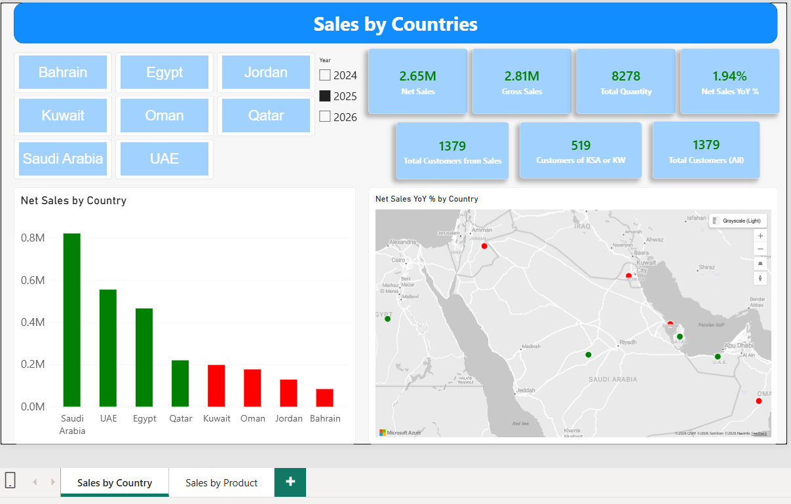
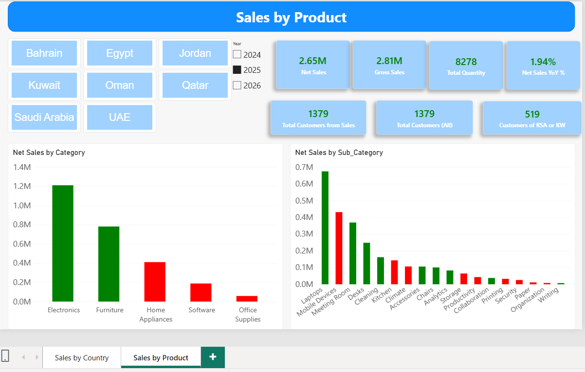
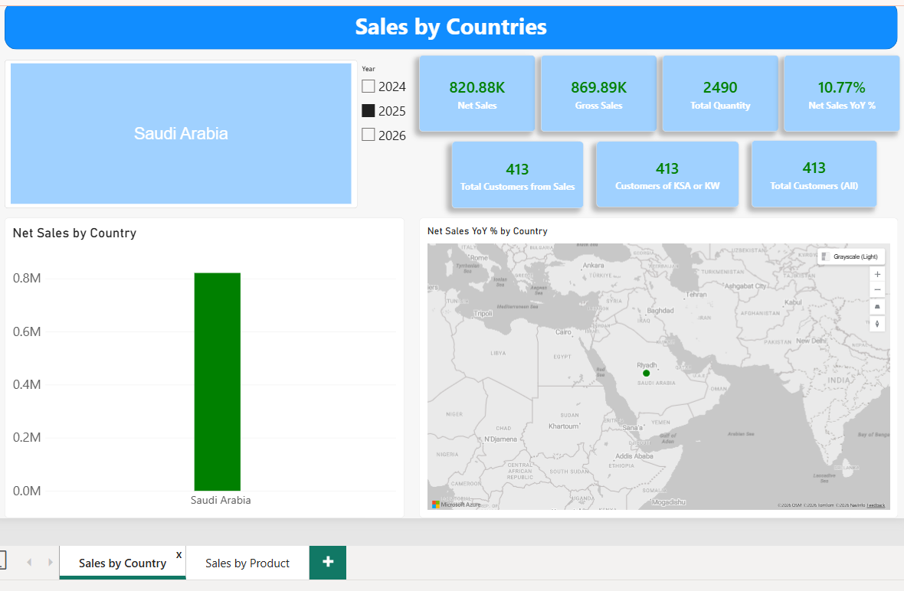

# Sales Performance Dashboard | Power BI

An interactive Power BI report analyzing 2024–2026 sales across 8 MENA countries (Saudi Arabia, UAE, Egypt, Kuwait, Qatar, Oman, Jordan, Bahrain), with product-level drill-down, year-over-year comparison, and role-based access for country managers.

## Business Problem

Management needed a clear view of which countries and product categories drive revenue and which are declining, while each country manager sees only their own market's data.

## Report Pages

### 1. Sales by Country (all countries, 2025)


### 2. Sales by Product (all countries, 2025)


### 3. Row-Level Security (CountryManager view)


A country manager sees only their own market. Even the fixed-total customer measures respect the role.

## Key Features

- Country and year slicers driving all visuals
- KPI cards: Net Sales, Gross Sales, Quantity, YoY %, Customers
- Green/red conditional formatting for growth vs. decline against the prior year
- Map and bar charts by country, category, and sub-category
- Role-based views for Country Managers

## Technical Highlights

- **Data modeling:** Dedicated Date table marked as a date table and related to the sales fact table
- **DAX:** YoY % with `SAMEPERIODLASTYEAR`, distinct customer counts, fixed totals using `ALL`, and a color measure for dynamic formatting
- **Security:** Row-Level Security (RLS) with a CountryManager role, tested with View as

### Sample DAX

```dax
Net Sales = SUM('SalesTransactions'[Net_Sales])

Net Sales YoY % =
IF(
    HASONEVALUE('Date'[Year]),
    VAR PrevYear =
        CALCULATE([Net Sales], SAMEPERIODLASTYEAR('Date'[Date]))
    RETURN
        DIVIDE([Net Sales] - PrevYear, PrevYear)
)

Color of Net Sales =
IF(
    ISBLANK([Net Sales YoY %]), "Gray",
    IF([Net Sales YoY %] >= 0, "Green", "Red")
)
```

## Key Insights (2025)

- Net sales reached 2.65M, up 1.94% on 2024.
- Saudi Arabia is the largest market at 820.88K (about 31% of net sales), up 10.77%.
- Saudi Arabia, UAE, Egypt and Qatar grew, while Kuwait, Oman, Jordan and Bahrain declined.
- Electronics (about 45% of sales) and Furniture grew, while Home Appliances, Software and Office Supplies declined.
- Laptops lead the sub-categories, while Mobile Devices, the second largest, declined.

## Recommendations

- Prioritize Electronics and Furniture in the growing markets.
- Investigate the decline in Home Appliances and Mobile Devices.
- Review low-contribution sub-categories for consolidation.

## Tools

Power BI Desktop · DAX · Time Intelligence · Row-Level Security · Conditional Formatting
